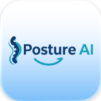

  

<h1 align="center">PostureAI</h1>

  <strong>Sit better. Work smarter.</strong> 
  PostureAI watches your posture with your AirPods or camera — 
  and gently blurs your screen until you sit up straight.

  <a href="https://a-normal-chill-guy.github.io/PostureAI/">Website</a> ·
  <a href="https://github.com/a-normal-chill-guy/PostureAI/releases">Download</a>

---

## Download

Download the latest release from the [Releases page](https://github.com/a-normal-chill-guy/PostureAI/releases).

- **macOS 13.0+** (Ventura or later)
- Apple Silicon & Intel
- Free · No account required

## Features

- **Private by design** — Camera frames and motion data are processed on-device and never leave your Mac.
- **No ads, no tracking** — PostureAI is built for your health, not for data collection.
- **AirPods or camera** — Head-tilt tracking through AirPods Pro/Max, or full body-pose detection via Apple's Vision framework.
- **Gentle progressive blur** — The reminder intensifies as posture worsens and clears instantly when you sit up straight.
- **On-device AI insights** — Optional Phi-3 Mini language model runs entirely on your Apple silicon.
- **Analytics that stay yours** — Daily scores, trends, and per-app posture stats stored locally.
- **Automatic updates** — Built-in Sparkle updater keeps you current with signed releases.

## Getting Started

See the [Get Started guide](https://a-normal-chill-guy.github.io/PostureAI/start/) for installation and setup instructions.

## Contributing

Have feedback or ideas? [Open an issue](https://github.com/a-normal-chill-guy/PostureAI/issues) to share your thoughts!

## Support

- [FAQ](https://a-normal-chill-guy.github.io/PostureAI/faq/)
- [Report an Issue](https://github.com/a-normal-chill-guy/PostureAI/issues)
- [Code of Conduct](CODE_OF_CONDUCT.md)
- [Security Policy](SECURITY.md)

## License

PostureAI is licensed under the [All Rights Reserved License](LICENSE). You may download and use the app, but may not redistribute or modify the source code.
